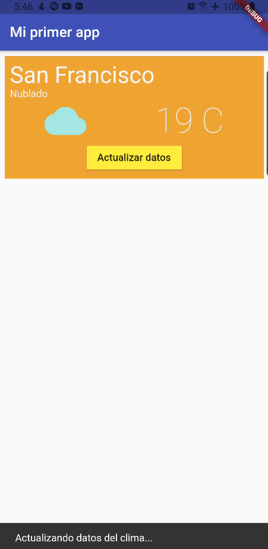

# App 1

App para practicar los siguientes temas:
- Widgets comunes
- Estilos de texto
- Colores
- renglones/columnas
- Alineacion de widgets

## Getting Started

Recuerda que despues de clonar el proyecto, abrir una terminal dentro de la carpeta del proyecto y ejecutar el comando:

```sh
flutter packages get
``` 

## App Screenshot




